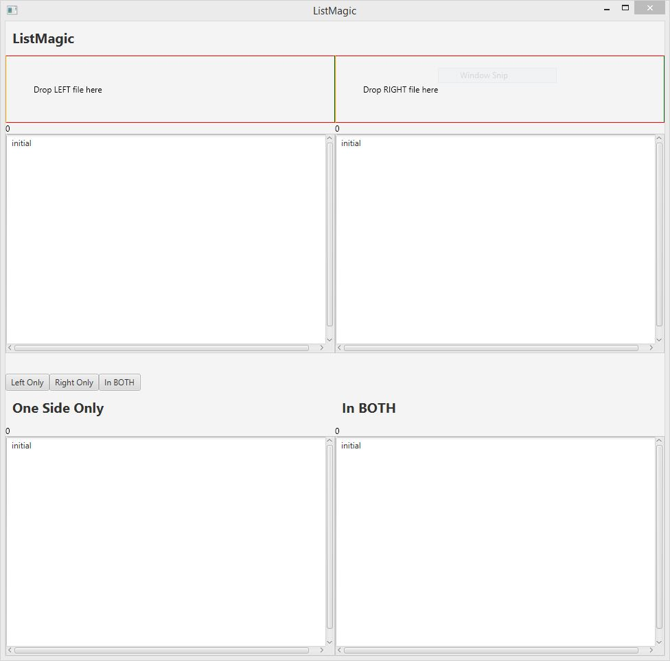

# ListMagic

## A Model-View-ViewModel (MVVM) example for TornadoFX

This project is a sample implementation in the Kotlin language of a Model-View-ViewModel (MVVM) GUI design using the wonderful TornadoFX Lightweight JavaFX Framework for Kotlin [https://github.com/edvin/tornadofx](https://github.com/edvin/tornadofx)

## Build and Run

Import the `pom.xml` file as a `Maven project` in the IntelliJ IDE.  Because Kotlin was invented by JetBrains/IntelliJ, it has the best support for Kotlin development.

Some sample files are in the `sample` directory; drop
one file onto the left and one onto the right, then,
use the buttons to compare the files.

Samples are from Tom Bombadil songs in the first book of Tolkien's Lord of the Rings trilogy.
